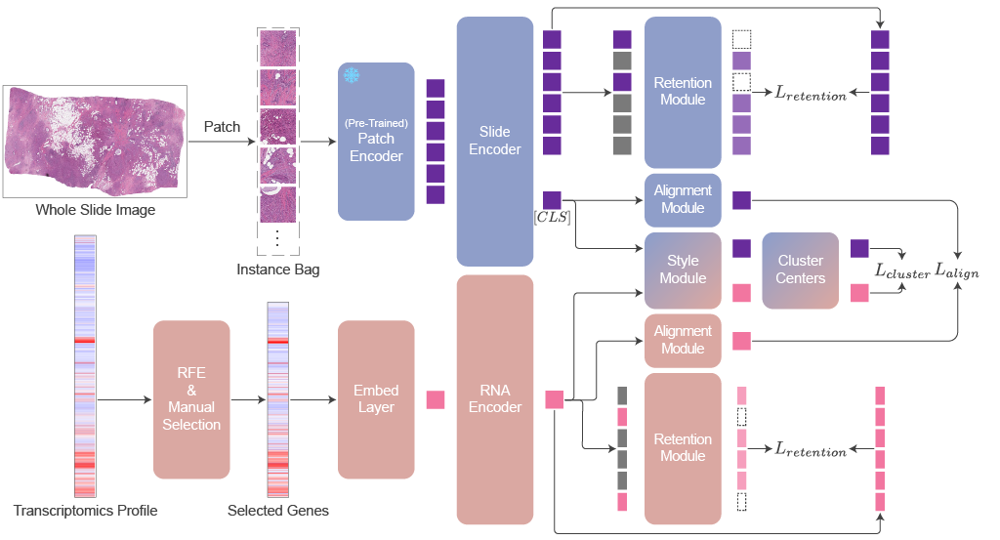

<h1 align="center">
  MIRROR: Multi-Modal Pathological Self-Supervised Representation Learning via Modality Alignment and Retention
</h1>

**[Tianyi Wang](https://github.com/TianyiFranklinWang)<sup>1</sup>, [Jianan Fan](https://dblp.org/pid/248/7360.html)<sup>1</sup>, [Dingxin Zhang](https://scholar.google.com/citations?user=ckAbIuYAAAAJ)<sup>1</sup>, [Dongnan Liu](https://scholar.google.com/citations?user=JZzb8XUAAAAJ)<sup>1</sup>, [Yong Xia](https://scholar.google.com/citations?user=Usw1jeMAAAAJ)<sup>2</sup>, [Heng Huang](https://scholar.google.com/citations?user=4OqLaDwAAAAJ)<sup>3</sup>, and [Weidong Cai](https://weidong-tom-cai.github.io)<sup>1</sup>**

<sup>1</sup>The University of Sydney &nbsp;&nbsp;&nbsp;
<sup>2</sup>Northwestern Polytechnical University &nbsp;&nbsp;&nbsp;
<sup>3</sup>University of Maryland

<p align="center">
  <a href="https://ieeexplore.ieee.org/document/11245622">
    
  </a>
  <a href="https://arxiv.org/abs/2503.00374">
    
  </a>
  <a href="https://github.com/TianyiFranklinWang/MIRROR">
    
  </a>
</p>

---

<p align="center">
  <em>🎉 MIRROR has been accepted for publication in <b>IEEE Transactions on Medical Imaging (TMI)</b>.</em>
</p>

---

> **Please give us a :star2: if you find our work useful!**

## Introduction

This is the official implementation of "MIRROR: Multi-Modal Pathological Self-Supervised Representation Learning via Modality Alignment and Retention".
MIRROR is a novel multi-modal representation learning method designed to foster both modality alignment and retention.
The detailed architecture is shown below.

We aspire for this repository to serve as a foundational framework for future research in computational pathology. It is fully equipped with a comprehensive suite of tools and all the necessary code for typical downstream tasks in this field.

<p align="center">
  
</p>

## Roadmap

- [x] Release the main codebase
- [x] Release tools
- [x] Update README
- [ ] Document code
- [ ] Add code structure in README

## Getting Started

### Clone the Repository

```bash
git clone git@github.com:TianyiFranklinWang/MIRROR.git
```

### Setup Environment

Python version: 3.10.16 **(use compatible version to avoid any issues)**

```bash
python -m pip install -r requirements.txt
lintrunner init
```

### Prepare Data
#### Histopathology Data

Follow the following steps to prepare the histopathology data:
- Download the TCGA dataset from the [GDC Data Portal](https://portal.gdc.cancer.gov/).
- Organize the slides by cohort in the `./input/TCGA/[cohort]` directory.
- Use the following script to extract patches from the slides:
```bash
python ./tools/gen_patch.py --input-dir ./input/wsi/TCGA \
 --cohorts TCGA_BRCA \
 TCGA_LUAD \
 TCGA_LUSC \
 TCGA_COAD \
 TCGA_READ \
 TCGA_KIRC \
 TCGA_KIRP \
 TCGA_KICH

```
In this example, we specify the cohorts used in our manuscript. To adjust the cohorts, simply replace the names in the `--cohorts` argument with your desired cohort names.
- Use `./tools/feature_generation/gen_patch_feature.py` to generate features from the patches. We give resnet50 and Phikon models as backbones. **Note:** Configuration is currently managed through the `Config` class. We plan to update this to use `argparser` for argument parsing in future updates.
```bash
python ./tools/feature_generation/gen_patch_feature.py
```

#### Transcriptomics Data

We provide the processed transcriptomics data on [Kaggle](https://www.kaggle.com/datasets/wangtyi/mirror-pruned-tcga-rnaseq-data), [Hugging Face](https://huggingface.co/datasets/Franklin2001/MIRROR_Pruned_TCGA_RNASeq_Data) and [Zenodo](https://zenodo.org/records/15043064) for TCGA-BRCA, TCGA-NSCLC, TCGA-COADREAD, and TCGA-RCC.

For custom data preparation:
- Download the transcriptomics data `tcga_RSEM_isoform_fpkm.gz` and mapping table `probeMap_gencode.v23.annotation.transcript.probemap` from [Xena](https://xenabrowser.net/datapages/?dataset=tcga_RSEM_isoform_fpkm&host=https%3A%2F%2Ftoil.xenahubs.net).
- After unzipping the transcriptomics file you will get a tsv file `tcga_RSEM_isoform_fpkm`. Put the extracted file and mapping table into the `./input/raw_rna_features/` directory.
**Tip:** I strongly recommend converting the `tcga_RSEM_isoform_fpkm` file from tsv to [Apache Parquet](https://parquet.apache.org/) using [pandas](https://pandas.pydata.org/docs/reference/api/pandas.DataFrame.to_parquet.html) and setting the first column as the index. This will speed up the processing and is compatible with our script.
- Download disease related genes from [COSMIC database](https://cancer.sanger.ac.uk/census) and put it under `./input/raw_rna_feature/[cohort]`.
- Use `./tools/distill_rna_feature.py` to generate the pruned transcriptomics features.
```bash
python ./tools/distill_rna_feature.py --cohort [cohort] \
 --cosmic-genes [cosmic_file_name] \
 --wsi-feature-root ./input/wsi_feature/[backbone]/TCGA_FEATURE \
 --classes [class0_in_cohort] [class1_in_cohort] ...
```

#### Survival Analysis Data

You can collect the data from [cBioPortal](https://www.cbioportal.org/) and place it under `./input/survival`.

### Pre-Training

We have two types of pre-training scripts. `train_pretrain.py` script is the vanilla CLIP-like training script and `train_mirror.py` script is for training our method.
For both scripts we adopted a YAML-based configuration system, you can find configuration templates in `./configs`, and you can modify them accordingly to suit your needs.

We also provide two ways to launch these scripts. One way is using bash scripts in `./scripts` directory.
```bash
./scripts/run_train_pretrain.sh <nnodes> <nproc_per_node> <rdzv_backend> <rdzv_endpoint> <config_file> <fold_nb> [additional_args...]
```
```bash
./scripts/run_train_mirror.sh <nnodes> <nproc_per_node> <rdzv_backend> <rdzv_endpoint> <config_file> <fold_nb> [additional_args...]
```
`nnodes`, `nproc_per_node`, `rdzv_backend` and `rdzv_endpoint` are the parameters for distributed training, you can find out more details [here](https://pytorch.org/docs/stable/elastic/run.html). `config_file` is the path to the configuration file. `fold_nb` is the fold number for cross-validation. `additional_args` are additional keywords arguments in training scripts.

Another way is through a naive job manager python script we provided in `./tools/pretrain_job_launcher.py`, which can automatically collect pre-training jobs and manage GPU resources. 
```bash
python ./tools/pretrain_job_launcher.py --gpu-count [number_of_gpus] \
 --virtual-gpu-count [number_of_jobs_per_gpu] \
 --pretrain-launch-script [pretrain_launch_script] \
 --pretrain-config [config_file]
```

### Downstream Tasks Evaluation
Downstream tasks evaluation scripts also adopt a YAML-based configuration system, you can find the templates in `./configs`. 
And, we also provide two different ways to initiate. Through bash script and job launcher.

```bash
./scripts/run_train_subtyping.sh <nnodes> <nproc_per_node> <rdzv_backend> <rdzv_endpoint> <config_file> <fold_nb> [checkpoint] [additional_args...]
```
```bash
./scripts/run_train_survival.sh <nnodes> <nproc_per_node> <rdzv_backend> <rdzv_endpoint> <config_file> <fold_nb> [checkpoint] [additional_args...]
```
`checkpoint` is an optional positional argument to specify if it should load pre-trained weight.

The job launcher `./tools/downstream_tasks_evaluator.py` can simultaneously manage both subtyping and survival analysis tasks.
```bash
python ./tools/downstream_tasks_evaluator.py --gpu-count [number_of_gpus] \
 --virtual-gpu-count [number_of_jobs_per_gpu] \
 --result-dir [pretrain_result_directory] \
 --checkpoint-file [pretrain_checkpoint_file_name] \
 --subtyping-linprob-config [subtyping_linear_probing_config_file] \
 --subtyping-10shot-config [subtyping_10shot_config_file] \
 --survival-linprob-config [survival_linear_probing_config_file] \
 --survival-10shot-config [survival_10shot_config_file]
```
`--result-dir` and `--checkpoint-file` are optional, if specified they will load the pre-trained weights automatically.

### Miscellaneous Tools

We also provide a number of miscellaneous tools to help your workflows.

- `./tools/gen_splits.py` is used to generate 5-fold cross-validation splits for each cohort.
```bash
python ./tools/gen_splits.py --root [path_to_wsi_features] \
 --class-name [TCGA_class_name]
```
- `./tools/gen_few_shot_files.py` is used to generate 5-fold cross-validation few-shot splits.
```bash
python ./tools/gen_few_shot_files.py --class-name [TCGA_class_name] \
 --survival-wsi-feature-dir [path_to_wsi_features_with_cohort] \
 --subyping-wsi-feature-dir [path_to_wsi_features_without_cohort] \
 --subyping-classes [class0_in_cohort] [class1_in_cohort] ... \
 --rna-feature-csv [path_to_pruned_rna_features] \
 --survival-csv [path_to_survival_data] \
 --split-dir [path_to_5foldcv_splits]
```
- `./tools/split_subtypes.py` is used to split the features by subtypes within a cohort.
```bash
python ./tools/split_subtypes.py --input-folder [path_to_wsi_features] \
 --oncotree-code-csv [path_to_survival_data] \
 --target-oncotree-codes [subtype1_oncotree_code] [subtype2_oncotree_code] ...
```
- `./tools/split_weights.py` is used to split the pre-trained weights into histopathology and transcriptomics parts.
```bash
python ./tools/split_weights.py --result-dir [path_to_pretrain_result] \
 --weight-file [weight_file_name]
```

### Linting Code

We use [lintrunner](https://github.com/suo/lintrunner) to check our code. You can run the following command to check the code quality.
```bash
lintrunner --all-files -a
```

## Contact  

For any inquiries or if you encounter issues, please feel free to contact us or open an issue.

## License

This project is released under the General Public License v3.0. Please see the [LICENSE](LICENSE) file for more information.

## Citation

If you find our work useful, please cite it using the following BibTeX entry:

```bibtex
@misc{wang2025mirror,
    title={MIRROR: Multi-Modal Pathological Self-Supervised Representation Learning via Modality Alignment and Retention},
    author={Tianyi Wang and Jianan Fan and Dingxin Zhang and Dongnan Liu and Yong Xia and Heng Huang and Weidong Cai},
    year={2025},
    eprint={2503.00374},
    archivePrefix={arXiv},
    primaryClass={cs.CV}
}
```

---
Develop with :heart: by [Tianyi Wang](https://github.com/TianyiFranklinWang) @ The University of Sydney
